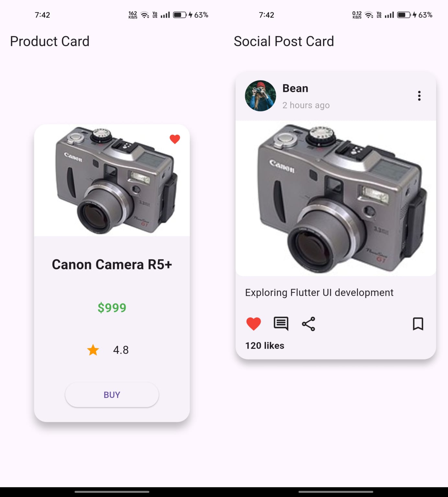
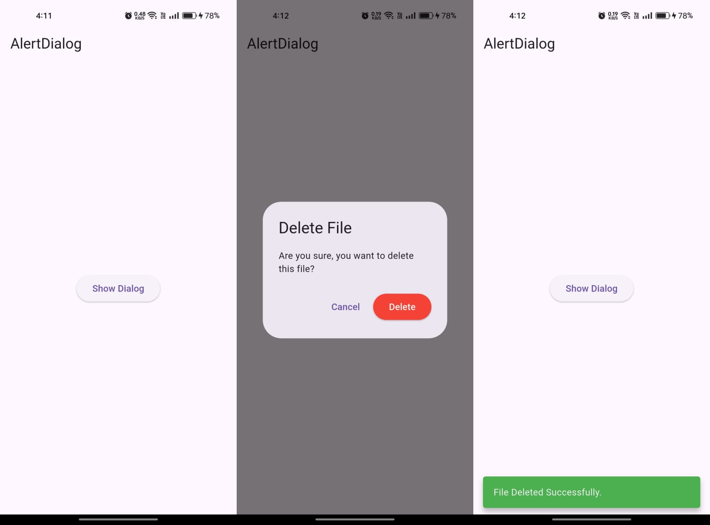
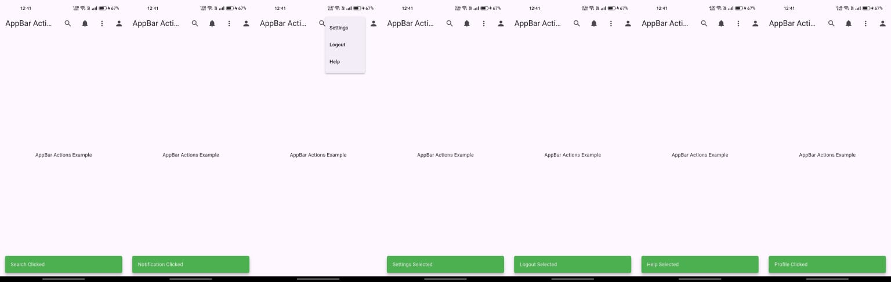
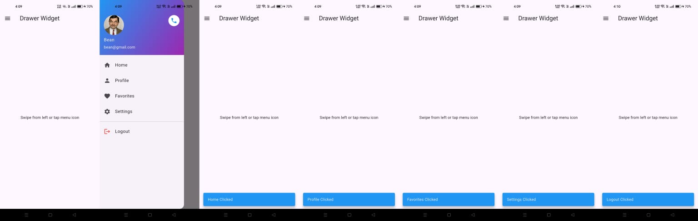
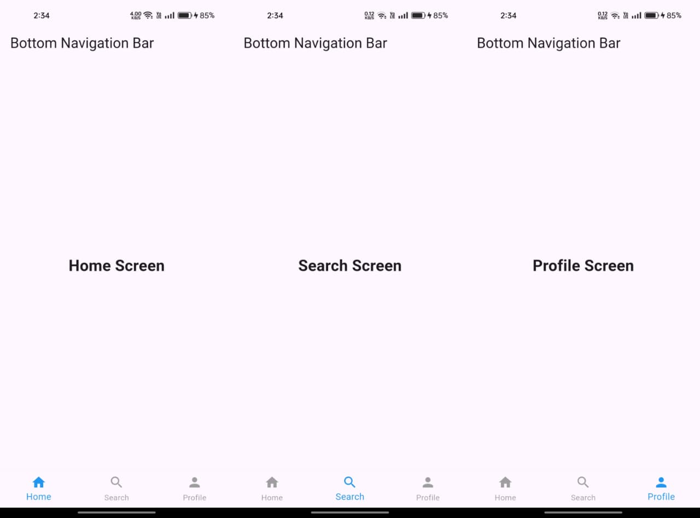
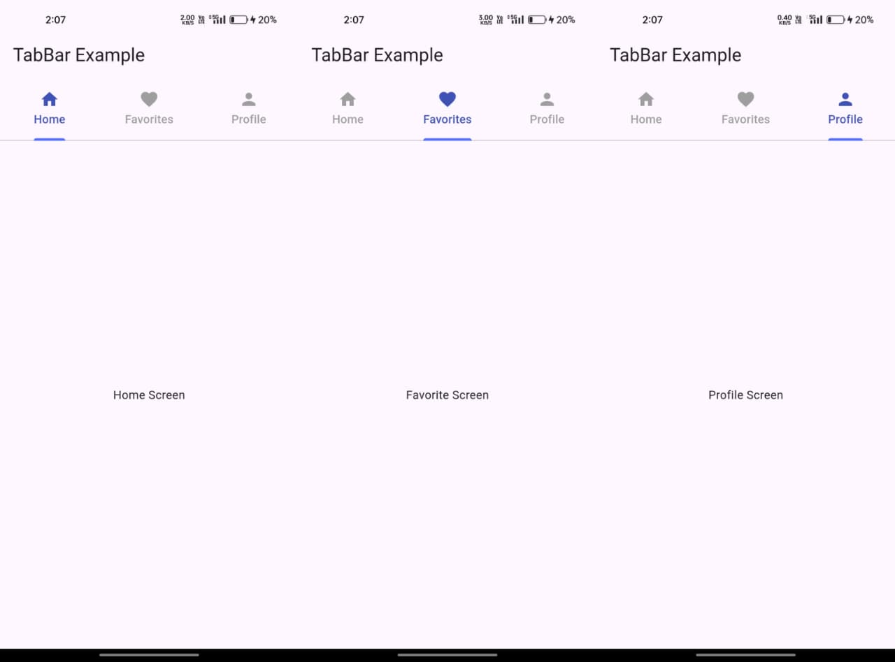
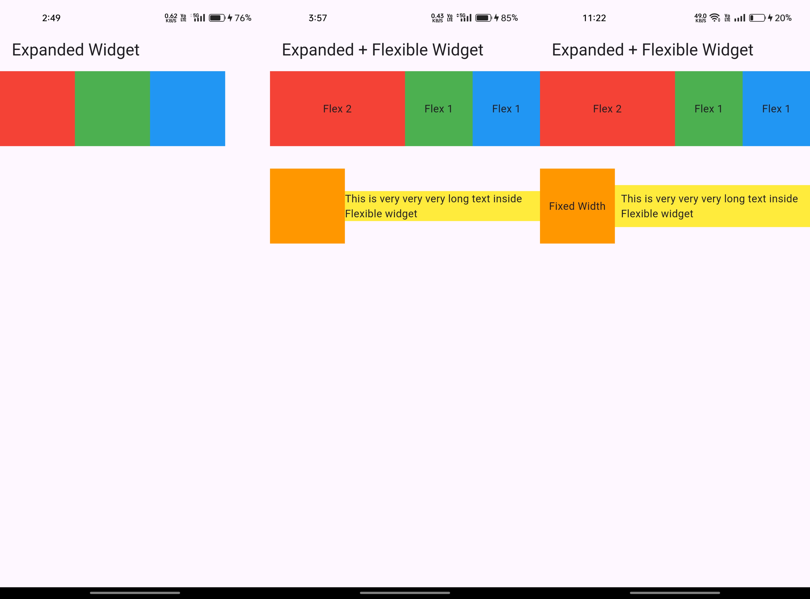

# Flutter Learning Journey

I'm learning Flutter from scratch and this repository is where I practice,
experiment, and build things as I go. Not a course project - just me figuring
things out step by step.

---

## What I've covered so far

- Setting up Flutter and understanding project structure
- MaterialApp, Scaffold, AppBar
- Layout widgets - Row, Column, Container, Stack
- Lists and Grids - ListView, GridView
- Stateful vs Stateless widgets
- Navigation between screens using Named Routes
- Passing data between screens
- Working with forms and text fields
- Asset management and loading images
- Building multi-screen apps
- Card Widget and Material Design UI
- Building Profile Cards
- Building Product Cards
- Creating Social Media Post UI
- Stack & Positioned for overlay layouts
- Spacer and advanced UI alignment
- Snackbar and temporary user feedback
- AlertDialog and popup interactions
- Confirmation flow handling
- Drawer widget with reusable navigation handling
- BottomNavigationBar and tab-based navigation
- StatefulWidget driven screen switching
- Dynamic UI updates using setState()
- Multi-screen architecture using separate screen files
- State-driven navigation patterns
- TabBar and TabBarView navigation
- Swipeable tab interfaces
- DefaultTabController based navigation
- Expanded widget for responsive space distribution
- Flexible widget for adaptive layouts 
- Responsive Row & Column layouts 
- Understanding proportional sizing using flex
---

## How this repo is structured

All screens are inside lib/screens. Reusable widgets will go into lib/widgets
as the project grows. lib/main.dart is the entry point and handles routing.

---

## Why I'm doing this

I want to get genuinely good at Flutter - not just follow tutorials but actually
understand why things work the way they do. This repo documents my real learning process as I build and improve with Flutter.

---

## Stack

- Flutter & Dart
- VS Code
- Android emulator for testing

---

## Screenshots

### Product Card + Social Post Card
E-commerce style Product Card with Stack and Positioned favorite icon overlay, and an Instagram-style Social Post Card with CircleAvatar profile header, action row using Spacer for bookmark alignment, and 120 likes counter.

### AlertDialog + Snackbar Flow
Shows a real-world user interaction flow using AlertDialog confirmation and Snackbar feedback after deletion action.

### AppBar Actions
Demonstrates real-world AppBar interaction patterns including search, notifications, profile, and a three-dot PopupMenuButton with dynamic Snackbar feedback on every action.

### Drawer Widget
A fully functional navigation Drawer with a gradient profile header using UserAccountsDrawerHeader, ListTile menu items with icons, a Divider separator, and floating Snackbar feedback on every tap.

### Bottom Navigation Bar
A multi-screen Bottom Navigation system built using StatefulWidget, setState(), and dynamic screen rendering with selectedIndex. Includes seperate screen architecture, active tab highlighting, and production-style BottomNavigationBar behavior.

### TabBar + TabBarView
Top tab navigation built using DefaultTabController, TabBar, and TabBarView with swipe gestures, active tab indicators, custom tab styling, and seperate screen architecture for scalable UI management.

### Expanded + Flexible Widget
Responsive Flutter layouts built using Expanded, Flexible, Row, and Column. Demonstrates proportional space distribution using flex values, adaptive text behavior, and responsive UI structure fundamentals.

---

## Current Focus

Currently learning:
- MediaQuery and responsive sizing
- Responsive Flutter UI
- Flutter UI architecture

---

Updated as I learn.
